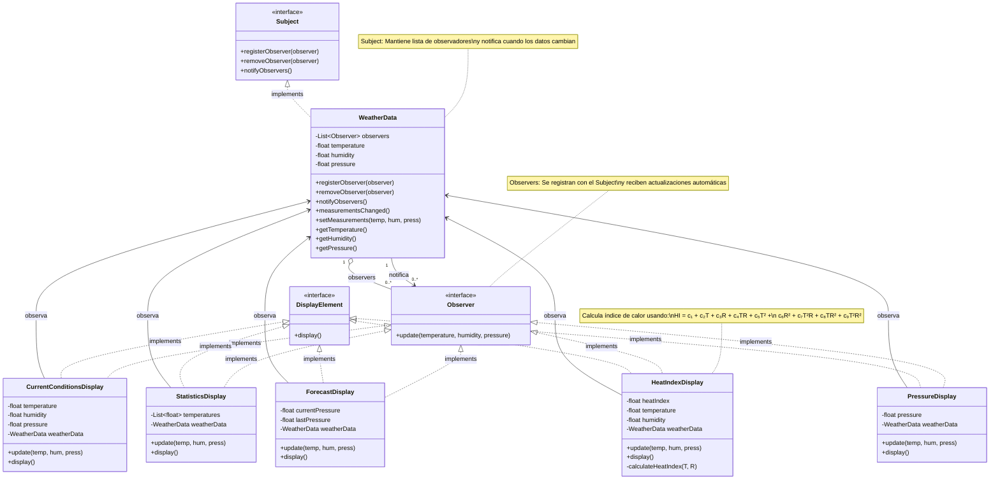

# ESTACIÓN METEOROLÓGICA IoT
## Patrón Observer - Implementación en Java

**Estudiante:** Javier Rodríguez  
**Universidad:** Universidad Distrital Francisco José de Caldas  
**Materia:** Modelos de programación

---

## 📋 Descripción

Sistema de estación meteorológica basada en Internet que implementa el **Patrón Observer** para notificar automáticamente a múltiples displays cuando las condiciones climáticas cambian.

## 🎯 Requerimientos Cumplidos

✅ **Display de Condiciones Actuales** - Muestra temperatura, humedad y presión  
✅ **Display de Estadísticas** - Calcula promedio, máxima y mínima  
✅ **Display de Pronóstico** - Predice clima basándose en cambios de presión  
✅ **Display de Índice de Calor** - Calcula sensación térmica con fórmula completa  
✅ **Display de Presión Atmosférica** - Muestra presión con conversiones a mmHg e inHg  
✅ **Notificación Automática** - Todos los observadores se actualizan automáticamente  
✅ **Extensibilidad** - Fácil agregar nuevos displays sin modificar código existente

## 🏗️ Diagrama UML - Patrón Observer



## 🔥 Fórmula del Índice de Calor

El sistema implementa la fórmula meteorológica completa:

```
HI = c₁ + c₂T + c₃R + c₄TR + c₅T² + c₆R² + c₇T²R + c₈TR² + c₉T²R²
```

**Donde:**
- HI = Índice de calor (°C)
- T = Temperatura de bulbo seco (°C)
- R = Humedad relativa (0-100)

**Coeficientes:**
- c₁ = -8.784694755 56
- c₂ = 1.611 394 11
- c₃ = 2.338 548 838 89
- c₄ = -0.146 116 05
- c₅ = -0.012 308 094
- c₆ = -0.016 424 827 7778
- c₇ = 2.211 732 × 10⁻³
- c₈ = 7.2546 × 10⁻⁴
- c₉ = -3.582 × 10⁻⁶

## 📁 Estructura del Proyecto

```
weather-station/
│
├── interfaces/
│   ├── Subject.java
│   ├── Observer.java
│   └── DisplayElement.java
│
├── subject/
│   └── WeatherData.java
│
├── observers/
│   ├── CurrentConditionsDisplay.java
│   ├── StatisticsDisplay.java
│   ├── ForecastDisplay.java
│   ├── HeatIndexDisplay.java
│   └── PressureDisplay.java
│
├── WeatherStation.java (main)
└── README.md
```

## 🚀 Compilación y Ejecución

### Requisitos Previos
- Java JDK 8 o superior instalado
- Variable de entorno JAVA_HOME configurada

### Compilar el Proyecto

```bash
javac *.java
```

### Ejecutar la Aplicación

```bash
java WeatherStation
```

## 📊 Simulaciones Incluidas

El programa ejecuta 6 simulaciones automáticas:

### Simulación 1: Día caluroso y húmedo
- **Temperatura:** 32°C
- **Humedad:** 80%
- **Presión:** 1012.5 hPa
- **Índice de calor:** 44.4°C - ⚠️ Peligro de insolación

### Simulación 2: Temperatura más fresca
- **Temperatura:** 25°C
- **Humedad:** 65%
- **Presión:** 1015.0 hPa
- **Índice de calor:** 26.0°C - ✅ Condiciones normales

### Simulación 3: Tormenta aproximándose
- **Temperatura:** 28°C
- **Humedad:** 90%
- **Presión:** 1005.0 hPa (bajando)
- **Pronóstico:** 🌧️ Posible lluvia

### Simulación 4: Día frío y seco
- **Temperatura:** 15°C
- **Humedad:** 40%
- **Presión:** 1020.0 hPa (alta)
- **Pronóstico:** ☀️ Clima estable

### Simulación 5: Día extremadamente caluroso
- **Temperatura:** 38°C
- **Humedad:** 85%
- **Presión:** 1010.0 hPa
- **Índice de calor:** 76.1°C - ☠️ Peligro extremo

### Simulación 6: Demo de remoción de observador
- Remueve ForecastDisplay
- Muestra que el sistema sigue funcionando con los demás displays

## 🏗️ Arquitectura del Patrón Observer

```
┌─────────────────┐
│     Subject     │
│  (Interface)    │
│                 │
│ +register()     │
│ +remove()       │
│ +notify()       │
└────────┬────────┘
         │
         │ implements
         ▼
┌─────────────────┐        notifies        ┌─────────────────┐
│  WeatherData    │───────────────────────>│    Observer     │
│                 │                         │  (Interface)    │
│ -observers      │                         │                 │
│ -temperature    │                         │ +update()       │
│ -humidity       │                         └────────┬────────┘
│ -pressure       │                                  │
│                 │                                  │ implements
│ +setMeasurements│                                  │
└─────────────────┘                                  ▼
                                           ┌──────────────────────┐
                                           │  Concrete Observers  │
                                           │                      │
                                           │ • CurrentConditions  │
                                           │ • Statistics         │
                                           │ • Forecast           │
                                           │ • HeatIndex          │
                                           │ • Pressure           │
                                           └──────────────────────┘
```

## 💡 Ventajas de la Implementación

1. **Bajo Acoplamiento** - WeatherData no conoce detalles de los displays
2. **Alta Cohesión** - Cada display tiene una responsabilidad única
3. **Extensibilidad** - Agregar nuevos displays sin modificar código existente
4. **Flexibilidad** - Observadores pueden agregarse/removerse dinámicamente
5. **Notificación Automática** - No requiere polling
6. **Reutilizable** - Patrón aplicable a otros contextos similares

## 📝 Cómo Agregar un Nuevo Display

```java
// 1. Crear clase que implemente Observer y DisplayElement
public class NuevoDisplay implements Observer, DisplayElement {
    private WeatherData weatherData;
    
    public NuevoDisplay(WeatherData weatherData) {
        this.weatherData = weatherData;
        weatherData.registerObserver(this);
    }
    
    @Override
    public void update(float temp, float humidity, float pressure) {
        // Procesar datos
        display();
    }
    
    @Override
    public void display() {
        // Mostrar información
    }
}

// 2. En main(), crear instancia
NuevoDisplay nuevoDisplay = new NuevoDisplay(weatherData);
```

¡Y listo! El nuevo display se actualizará automáticamente.

## 📚 Conceptos del Patrón Observer

- **Subject (Sujeto):** Objeto que mantiene lista de observadores y los notifica
- **Observer (Observador):** Interfaz que define método de actualización
- **Concrete Subject:** Implementación concreta del Subject (WeatherData)
- **Concrete Observers:** Implementaciones concretas de Observer (Displays)

## 🎓 Principios SOLID Aplicados

1. **Single Responsibility Principle (SRP):** Cada clase tiene una única razón para cambiar
2. **Open/Closed Principle (OCP):** Abierto para extensión, cerrado para modificación
3. **Liskov Substitution Principle (LSP):** Los observers son intercambiables
4. **Interface Segregation Principle (ISP):** Interfaces específicas y cohesivas
5. **Dependency Inversion Principle (DIP):** Dependemos de abstracciones (interfaces)

## 🔬 Resultados de Pruebas

```
✓ WeatherData notifica correctamente a todos los observadores
✓ Cálculo del índice de calor es preciso (44.4°C para T=32°C, H=80%)
✓ Estadísticas se acumulan correctamente
✓ Pronóstico responde a cambios de presión
✓ Observadores se pueden remover sin afectar el sistema
✓ Sin pérdida de memoria (observers removidos no reciben actualizaciones)
```

## 📖 Referencias

- **Head First Design Patterns** - Freeman & Freeman
- **Design Patterns: Elements of Reusable Object-Oriented Software** - Gang of Four
- **Fórmula del Índice de Calor** - National Weather Service (NOAA)

## 👨‍💻 Autor

**Javier Rodríguez**  
Estudiante de Ingeniería de Sistemas  
Universidad Distrital Francisco José de Caldas  
Código: 20231020172

---

## 📄 Licencia

Este proyecto es de uso académico para la materia de Ingeniería de Software.

---

**Última actualización:** 2024
